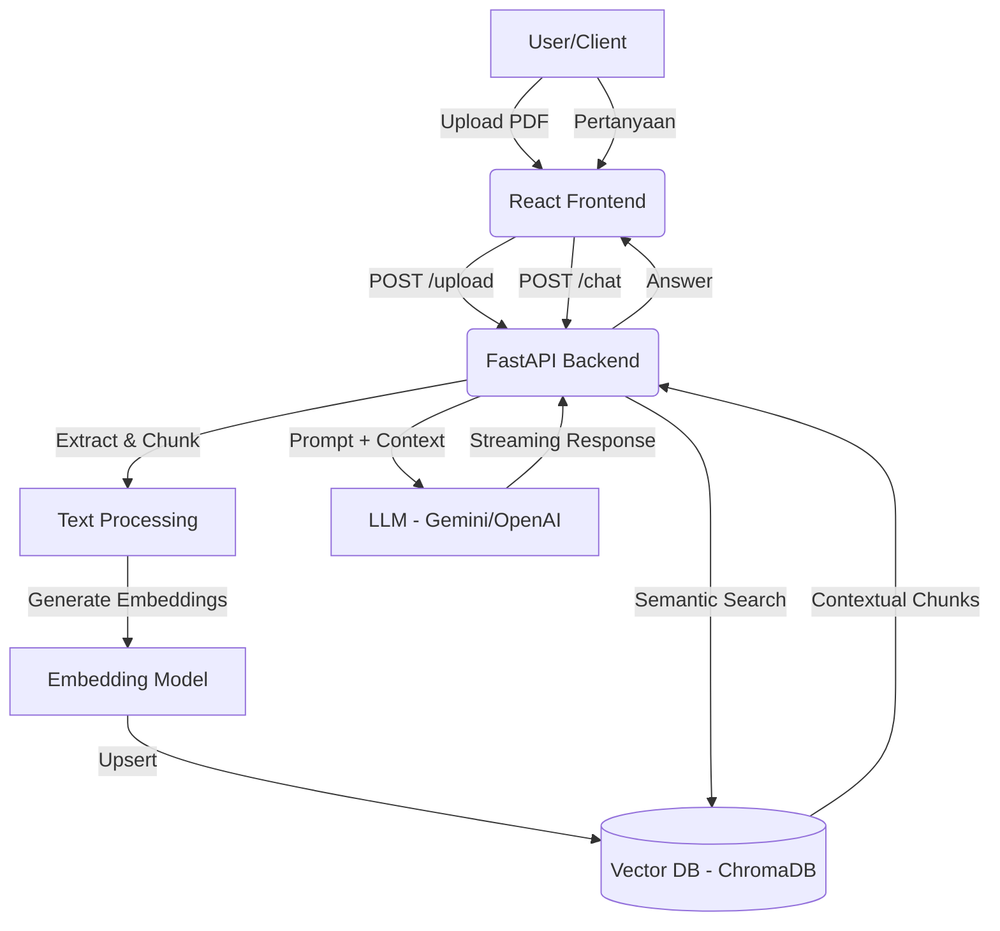

# AI PDF-RAG: Sistem Analisis Dokumen Pintar (Tugas Akhir)

Sistem berbasis kecerdasan buatan (AI) yang dirancang untuk membantu ekstraksi informasi dan tanya jawab (Q&A) berbasis dokumen PDF menggunakan metode **Retrieval-Augmented Generation (RAG)**.

## 🚀 Fitur Utama

- **Upload PDF**: Antarmuka unggahan dokumen yang intuitif.
- **Text Extraction**: Ekstraksi teks otomatis dari file PDF untuk diproses oleh sistem.
- **AI RAG (Retrieval Augmented Generation)**:
  - Pencarian informasi kontekstual dari dokumen.
  - Chatbot interaktif yang menjawab berdasarkan isi dokumen yang diunggah.
  - Meminimalisir halusinasi AI dengan referensi data nyata.
- **Vector Database**: Penyimpanan cerdas (embeddings) untuk pencarian dokumen yang cepat dan akurat.

## 🏗️ Arsitektur Sistem

Sistem ini dibangun dengan arsitektur **Decoupled**, memisahkan antara UI (Frontend) dan pemrosesan AI (Backend).



## 🛠️ Arsitektur & Teknologi

### Frontend (React.js)

- **React 18/19**: Library UI modern untuk membangun antarmuka yang reaktif.
- **Vite**: Build tool super cepat untuk pengembangan frontend.
- **Tailwind CSS**: Framework CSS berbasis utility untuk desain premium dan responsif.
- **Axios**: Komunikasi data dengan API Backend.

### Backend (FastAPI)

- **FastAPI**: Framework Python berperforma tinggi untuk membangun API dengan dokumentasi Swagger terintegrasi.
- **Uvicorn**: ASGI server untuk menjalankan aplikasi FastAPI.
- **Pydantic**: Validasi data dan pengaturan skema API.

### AI & Data Pipeline

- **LangChain**: Framework utama untuk mengelola rantai logika LLM dan RAG.
- **OpenAI / Gemini API**: Model bahasa (LLM) untuk pemrosesan konteks dan jawaban.
- **Sentence Transformers**: Model embedding untuk mengubah teks menjadi vektor angka.
- **ChromaDB / FAISS**: Vector store untuk penyimpanan dan pencarian data berbasis semantik.

## 🧠 Konsep & Komponen RAG AI

Sistem ini mengikuti alur **Retrieval-Augmented Generation** yang terdiri dari beberapa komponen kunci:

1. **Document Loader**: Memuat file PDF dan mengekstrak teks mentah menggunakan library seperti `PyMuPDF` atau `LangChain PDF Loaders`.
2. **Text Splitter (Chunking)**: Memecah teks besar menjadi potongan-potongan kecil (_chunks_) dengan _overlap_ tertentu agar konteks tetap terjaga.
3. **Embedding Model**: Mengonversi setiap chunk teks menjadi vektor (array numerik) yang merepresentasikan makna semantik teks tersebut.
4. **Vector Database**: Menyimpan vektor-vektor tersebut. Saat pengguna bertanya, sistem mencari chunk yang paling relevan secara semantik (Similarity Search).
5. **Context Retrieval**: Mengambil chunk yang paling relevan untuk dijadikan referensi bagi AI.
6. **Prompt Engineering**: Menggabungkan konteks yang ditemukan dengan pertanyaan pengguna ke dalam satu _template prompt_ yang instruktif.
7. **LLM Generation**: Model AI (seperti GPT-4 atau Gemini) menghasilkan jawaban akhir berdasarkan konteks yang diberikan, bukan hanya dari pengetahuan internalnya.

## 📡 API Endpoints (Technical Spec)

### 1. Document Management

- **`POST /api/v1/docs/upload`**
  - **Payload**: `multipart/form-data` (file: .pdf)
  - **Proses**: PDF -> Extract -> Chunk (Size: 1000, Overlap: 200) -> Embedding -> ChromaDB storage.
  - **Response**: `201 Created` dengan `document_id`.

- **`GET /api/v1/docs`**
  - **Response**: List dokumen yang telah diproses.

### 2. AI Interaction

- **`POST /api/v1/chat`**
  - **Payload**: `{ "query": "string", "session_id": "string", "document_id": "string" }`
  - **Proses**: Vector search (Top-K: 4) -> Context Window -> LLM Call.
  - **Response**: `{ "answer": "string", "sources": [...] }`

## ⚙️ Konfigurasi Environment

Buat file `.env` di folder `backend/`:

```env
OPENAI_API_KEY=your_openai_key_here
# atau
GOOGLE_API_KEY=your_gemini_key_here
DATABASE_URL=sqlite:///./sql_app.db
CHROMA_DB_PATH=./data/chromadb
MODEL_NAME=gpt-4o-mini # atau gemini-1.5-flash
```

## 📦 Instalasi

### 1. Prasyarat

- Node.js & npm
- Python 3.12+
- AI API Key (OpenAI/Gemini)

### 2. Setup Frontend

```bash
cd frontend
npm install
npm run dev
```

### 3. Setup Backend (Jika Ada)

```bash
cd backend
pip install -r requirements.txt
python main.py
```

## 📖 Cara Penggunaan

1. Jalankan aplikasi frontend dan backend.
2. Unggah file PDF melalui dashboard.
3. Tunggu proses ekstraksi dan _vectorizing_ selesai.
4. Masukkan pertanyaan pada kolom chat yang tersedia.
5. AI akan menjawab berdasarkan konten PDF tersebut.

## 📄 Struktur Proyek

- `frontend/`: Source code aplikasi web (React).
- `backend/`: API server dan logika RAG (Python).
- `docs/`: Dokumentasi teknis Tugas Akhir.

---

ALII UIN Jakarta 2026